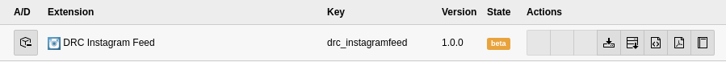
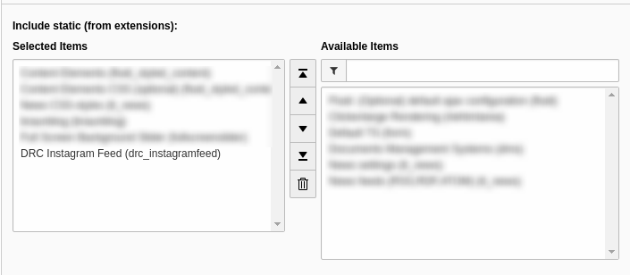
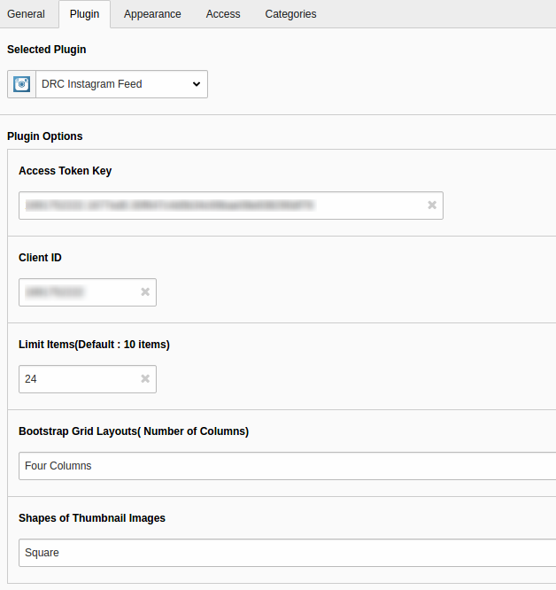

.. ==================================================
.. FOR YOUR INFORMATION
.. --------------------------------------------------
.. -*- coding: utf-8 -*- with BOM.

Users manual
============

**Installation**

1.Download the extension from the TYPO3 repositroy as t3x or zip and install the extension with the extension manager.

2.After that include the default static template

3.Now add the plugin on the page where you want the instagram feed by adding the new content on the page and select “General Plugin” you will get the “DRC Instagram Feed”

Here you can set the configuration as per you requirement its easy to setup. You can select the following option

• First you have to generate the "Access Token Key" of your instagram 
  (Link to generate token : http://instagram.pixelunion.net/)
• Next you have to ad your instagram "Client ID"
• Next you can define the number of images to fetch from the instagram by default it will show 10.
• Next you have to define the Bootstrap Grid Layout means the number of columns to display the images.
• Next you have to add the shape of the thumbnail you want to display in frontend.

Finally you done with the extension setup now you can see thumbnails in the frontend of your instagram account as per your setup.

Enjoy!...

**Configuration TypoScript**

You can get the rid on the css and js by adding following in template setup of you website.

*Including the JQuery Library*

plugin.tx_drcinstagramfeed_drcinstagramfeed.instagram.jqueryminjs

*Including the Bootstrap Min JS*

plugin.tx_drcinstagramfeed_drcinstagramfeed.instagram.bootstrapminjs

*Including the Bootstrap Min CSS*

plugin.tx_drcinstagramfeed_drcinstagramfeed.instagram.bootstrapmincss

*Including the Instagram  Default CSS*

plugin.tx_drcinstagramfeed_drcinstagramfeed.instagram.css 
